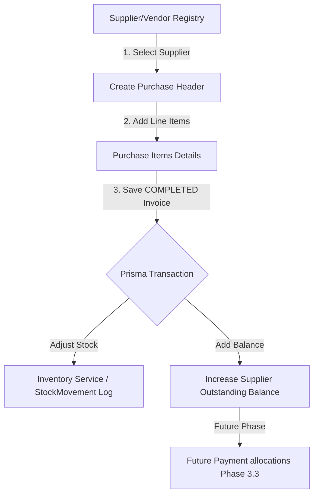

# Phase 3.1 - Purchase Management (Trading Module)

This document contains the functional architecture, business logic workflow, database schema modifications, and validation rules for the Purchase Management module.

---

## 1. Business Workflow Diagram

Below is the standard operational flow diagram for Trading Purchases. This acts as the blueprint for subsequent development phases:



---

## 2. Database Schema Adjustments

We added dedicated database models for purchase headers and items instead of relying on generic invoice models:

```prisma
enum PurchaseStatus {
  DRAFT
  COMPLETED
  CANCELLED
}

enum PurchasePaymentStatus {
  UNPAID
  PARTIALLY_PAID
  PAID
}

model Purchase {
  id                    String                @id @default(uuid())
  purchaseNumber         String                @unique
  supplierId             String
  supplier               Contact               @relation(fields: [supplierId], references: [id], onDelete: Restrict)
  purchaseDate           DateTime              @default(now())
  supplierInvoiceNumber  String?
  reference              String?
  notes                  String?
  discount               Decimal               @default(0.0) @db.Decimal(12, 2)
  transportCharges       Decimal               @default(0.0) @db.Decimal(12, 2)
  subtotal               Decimal               @db.Decimal(12, 2)
  grandTotal             Decimal               @db.Decimal(12, 2)
  status                 PurchaseStatus        @default(COMPLETED)
  paymentStatus          PurchasePaymentStatus @default(UNPAID)
  createdAt              DateTime              @default(now())
  updatedAt              DateTime              @updatedAt
  items                  PurchaseItem[]
}

model PurchaseItem {
  id           String   @id @default(uuid())
  purchaseId   String
  purchase     Purchase @relation(fields: [purchaseId], references: [id], onDelete: Cascade)
  productId    String
  product      Product  @relation(fields: [productId], references: [id], onDelete: Restrict)
  quantity     Decimal  @db.Decimal(12, 2)
  unitId       String
  unit         Unit     @relation(fields: [unitId], references: [id], onDelete: Restrict)
  purchaseRate Decimal  @db.Decimal(12, 2)
  discount     Decimal  @default(0.0) @db.Decimal(12, 2)
  lineTotal    Decimal  @db.Decimal(12, 2)
  remarks      String?
}
```

---

## 3. Business & Validation Rules

### A. Numbering Service
* Purchase Numbers are generated automatically on the server (format: `PUR-YYYY-SequenceNumber`, e.g., `PUR-2026-000001`) by querying the highest sequence number in the current calendar year.
* Supplier Invoice Numbers are optional fields for storing the original vendor paper invoice reference.

### B. Inventory Guard (Inventory Service)
* Direct edits on `Product.currentStock` are blocked throughout the codebase.
* All changes must use the `InventoryService` module which updates current stock and logs a matching `StockMovement` row inside a Prisma transaction wrapper.

### C. Validation
* A supplier selection is mandatory.
* Invoices must contain at least one line item.
* Quantities must be positive; purchase rates must be non-negative.
* Duplicate product rows are automatically merged on submit (summing quantities and computing weighted average rates).

### D. Cancellations
* Completed purchases are non-editable.
* Cancellations are allowed, which sets status to `CANCELLED` and triggers automatic, audit-safe reversal stock movements and decreases the supplier's outstanding balance.

---

## 4. Known Limitations & Future Roadmap
* **Payment Allocation**: Payment registries and allocating invoices are postponed until **Phase 3.3 (Payments)**.
* **Tax Calculations**: Placeholders are preserved for future VAT/GST allocations.
